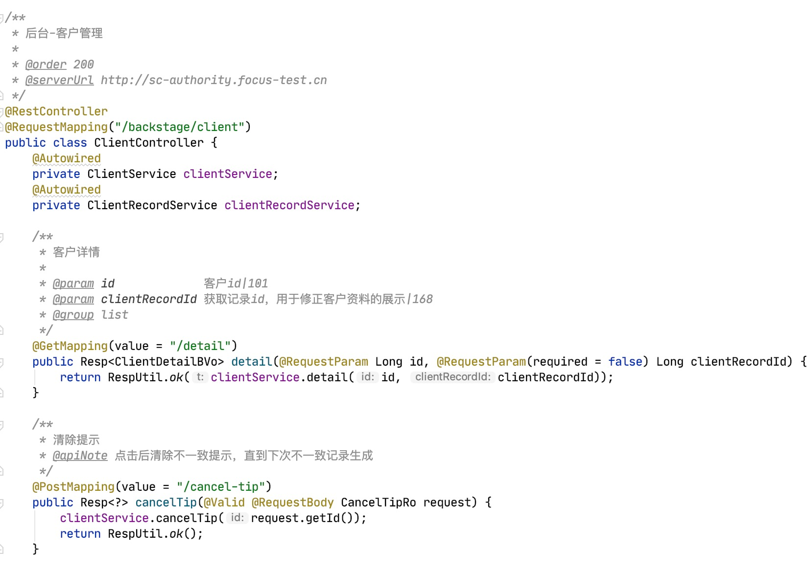
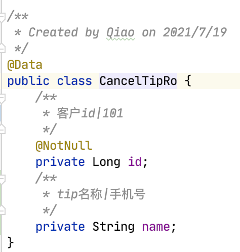
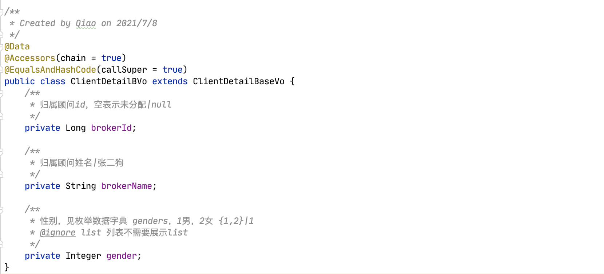
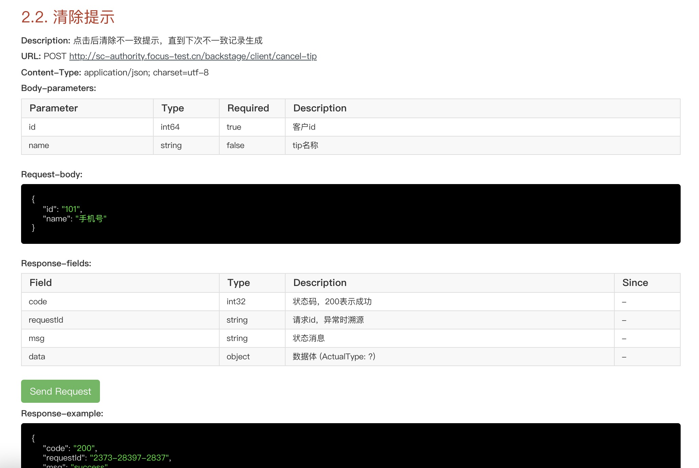

### Smart-Doc 修改简化版
**原项目 https://github.com/smart-doc-group/smart-doc**  
本项目在原项目基础上修改，增删一些功能，个人学习使用，正版使用请支持原版

### 说明
* 根据 Controller、Method、传入参数、返回值的 ***JavaDoc注释***
  自动生成文档，没有注释的 Controller、Method 不会生成对应文档
* 默认会生成文档的请求、响应示例，建议在每个参数注释后加上 **"|"**
  mock示例数据，可覆盖随机mock
* 是否必填 ***Required*** 会根据 ***@RequestParam*** ***@NotNull***
  ***@NotEmpty*** 等注解来生成，且会根据 ***@Validated***
  分组来判断，要合理使用 ***Valid*** 系列注解

### 引入依赖
```
<plugins>
    <plugin>
        <groupId>cn.focus</groupId>
         <artifactId>focus-smart-doc-maven-plugin</artifactId>
         <version>4.0</version>
         <configuration>
             <configFile>./src/main/resources/config/smart-doc.json</configFile>
             <includes>
                 <include>com.alibaba:fastjson</include>
             </includes>
         </configuration>
         <executions>
             <execution>
                 <goals>
                     <goal>html</goal>
                 </goals>
             </execution>
         </executions>
     </plugin>
 </plugins>
```

### 最简配置
```
smart-doc.json:

{
  "projectName": "xxx接口文档 v1.0",
  "serverUrl": "https://xxx.test.cn"
}
```

### 可选配置
```
smart-doc.json:

{
  "projectName": "xxx接口文档 v1.0", // 文档title，默认空
  "serverUrl": "http://xxx.test.cn", // 文档url，调试SendRequest也是这个url，注意跨域问题可能导致调不通，默认空
  "version": "1.0", // 展示版本号，默认空
  "outPath": "code/src/main/resources/doc", // 文档输出地址，默认输出到当前项目resources/doc
  "packageFilters": "cn.focus.sc.data.controller", // 包过滤，默认全部包
  "requestExample": true, // 是否展示请求示例，默认true
  "responseExample": true, // 是否展示响应示例，默认true
  "createDebugPage": true, // 是否开启调试(SendRequest)，默认true，否则不能调试，不能编辑输入参数
  "randomMock": true, // 是否随机mock示例数值，默认true，否则全输出为null
  "sourceCodePaths":{
    "path":"/Users/Qiao/Documents/IdeaProjects/sc-data/code/src/main/java" // 源码地址，默认当前项目的 src/main/java
  },
  "revisionLogs": [ // 版本更新说明，默认空
       {
         "version": "1.0",
         "revisionTime": "2021-07-15 16:00",
         "author": "QiaoJianCheng",
         "status": "create",
         "remarks": "1.0 初版"
       }
  ],
  "descriptions": [ // 调用说明，默认空
    "此处是调用说明",
    "1.所有请求必须携带token所有请求必须携带token",
    "2.所有请求必须携带token所有请求必须携带token"
  ],
  "dataDictionaries": [ // 枚举列表，默认空
    {
      "title": "获取来源",
      "enumClassName": "cn.focus.sc.data.enums.SourceEnum",
      "codeField": "code",
      "descField": "name"
    }
  ],
  "errorCodeDictionaries": [ // 错误码列表，默认空
    {
      "title": "错误码",
      "enumClassName": "cn.focus.sc.data.enums.CodeEnum",
      "codeField": "code",
      "descField": "msg"
    }
  ]
}
```

## JavaDoc @tag的使用
所有 ***Controller*** ***Method*** ***Filed*** 都必须使用
***JavaDoc注释***，Doc注释内容即为小标题，换行后使用 **@tag *param***，实现一些功能

|         JavaDoc tag          |                      可用位置                     |               说明                |
|       ----          |                    ----                       |                 -----            |
| @order *100*         | Controller                                       |  左侧文档目录排序          |
| @author *Qiao*      | Controller <br> Method                            |  作者             |
| @serverUrl *http://...*      | Controller <br> Method                            |  指定serverUrl，会覆盖config里的serverUrl，用于从zuul路由过来的情况，可填写来源服务的url |
| @kafka     | Controller <br> Method                            |  标记 ***Controller*** 或 ***Method*** 标记为kafka文档，只生成 ***Topic*** 和 ***Response*** |
| @apiNode *详细说明*         | Controller <br> Method                                       |  对本页文档或本方法的详细说明          |
| @ignore <br> @ignore *editEstate* | Controller <br> Method <br> Filed | 忽略 ***Controller*** 、***Method*** 、***Filed*** ，不生成其文档。 <br> 作用在 ***Filed*** 时，若有分组，则只有与 ***Method*** 分组相同的字段才忽略。 |
| @group *editEstate*       | Method                                            | 方法分组，配合 ***@ignore*** 使用，可忽略某个分组下的字段 |
| @ignoreParams *groupId,estateId*         | Method                                       |  忽略方法的一些参数，不生成文档          |
| @param **estateId**  *楼盘id，所有楼盘接口必填\|10086*         |   Method                                       |  参数说明，其中 ***\|*** 后面为mock请求响应示例的值，不写则根据配置随机mock或null          |
| @page */tool/trial.html*         |   Method                                       |  标记该方法为一个页面，点击 ***Send Request*** 会打开这个页面          |
| @download          |   Method                                       |  标记该方法为下载请求，点击 ***Send Request*** 会下载文件          |
| @mock *10086*         |   Filed                                       |  mock请求或响应示例，或者字段的 ***注释\|10086*** 也能实现mock值          |
| @required         |   Filed                                       |  强制为必填参数，建议使用 ***NotNull*** 系列注解来控制是否必填          |

### 举个栗子🌰
##### Controller、Method
 <br>

##### Ro
 <br>

##### Vo
 <br>

##### Example
 <br>
 
 
 
 
 
 
 
 
 
 
 
 
 
 